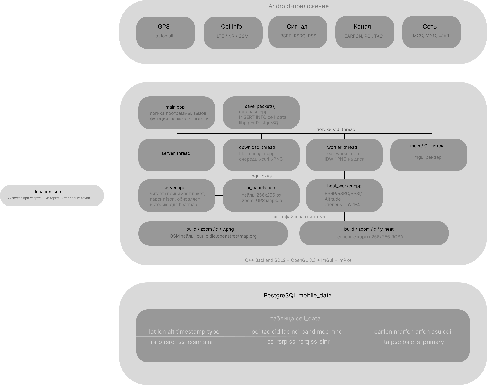

# android2

## Общая информация

Серверная часть проекта по дисциплине «Визуальное программирование».  
Клиентская часть (Android) располагается в смежном репозитории **android_project**.

### Системные библиотеки (устанавливаются отдельно)

| Библиотека | Назначение |
|-----------|-----------|
| **SDL2** | Окно, события, OpenGL-контекст |
| **GLEW** | Загрузка OpenGL-расширений |
| **OpenGL** | Рендеринг |
| **libcurl** | Загрузка тайлов OSM по HTTP |
| **libpng** | Декодирование PNG-тайлов |
| **libzmq + cppzmq** | Приём телеметрии по TCP |
| **libpqxx** | Сохранение в PostgreSQL |

### Сторонние библиотеки в third_party/ (субмодули)

| Папка | Библиотека | Назначение |
|-------|-----------|-----------|
| `imgui/` | Dear ImGui | Интерфейс и окна |
| `implot/` | ImPlot | Графики RSRP, GPS, высоты |
| `json/` | nlohmann/json | Парсинг JSON-телеметрии |
| `nlohmann/` | nlohmann/json | Альтернативный путь для CMake |

В папке `src/` находится модульный код проекта:
- `tile_manager.h / tile_manager.cpp` — Загрузка и кэширование тайлов OpenStreetMap
- `heat_worker.h / heat_worker.cpp` — Фоновый сбор точек трека для каждого PCI
- `location_data.h / location_data.cpp` — Хранилище всех данных (координаты, сигнал, история, соты)
- `server.h / server.cpp` — ZMQ-сервер на порту 5566, принимает данные с телефона
- `map_renderer.h / map_renderer.cpp` — Отрисовка карты OpenStreetMap
- `ui_panels.h / ui_panels.cpp` — Все ImGui-панели
- `database.h / database.cpp` — Сохранение в PostgreSQL
- `main.cpp` — Точка входа, инициализация и главный цикл

Папка `build/` внесена в `.gitignore`.

---

## Реализованный функционал

Все цели проекта достигнуты:

| Задача | Статус |
|--------|--------|
| Приём телеметрии по TCP (ZeroMQ) |  Реализовано |
| Парсинг JSON и построение графиков RSRP по вышкам |  Реализовано |
| Локальный бекап в `location.json` |  Реализовано |
| Интеграция PostgreSQL  |  Реализовано |
| Интерактивная карта (OSM тайлы, Zoom/Pan, GPS-трек) |  Реализовано |
| Heatmap  |  Реализовано |
| Фильтры по PCI для heatmap |  Реализовано |
| Тёмная цветовая схема интерфейса (ImGui) |  Реализовано |

---

## Сборка проекта

**Зависимости:** `cmake`, `g++` (C++17), `libsdl2-dev`, `libglew-dev`, `libcurl4-openssl-dev`, `libpng-dev`, `libzmq3-dev`, `cppzmq-dev`, `libpqxx-dev`, `nlohmann-json3-dev`, `Dear ImGui`, `ImPlot`.

```bash
mkdir build && cd build
cmake ../
make -j$(nproc)
```

Запуск:
```bash
./example_app
```

---

## Архитектура проекта

### Потоки

| Поток | Класс | Назначение |
|-------|-------|-----------|
| `main` | — | GUI, отрисовка, главный цикл |
| `server_thread_` | `ZMQServer` | Приём телеметрии по TCP |
| `download_thread_` | `OSMTileManager` | Скачивание тайлов OSM |
| `worker_thread_` | `HeatWorker` | Накопление точек трека |




---
